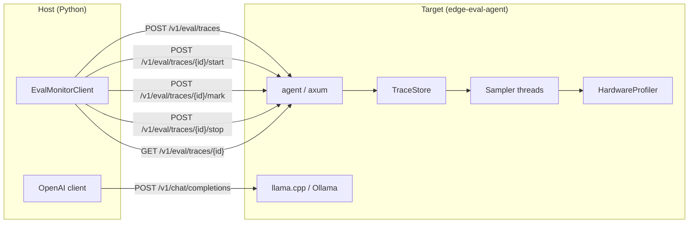

# edge-eval-agent

Hardware monitoring sidecar for **jishubench** (Target side). The shipped binary is
named **`edge-eval-agent`**.

Exposes a `/v1/eval/*` HTTP API that the Host Python `EvalMonitorClient`
calls to create and control hardware-sampling traces. The agent is intentionally
kept thin: it does **not** handle inference, only timestamps and hardware metrics.

## Architecture

## Data flow

1. Host calls `POST /v1/eval/traces` to register a new trace
2. Host calls `POST /v1/eval/traces/{id}/start` -- the agent spawns a background
   sampler thread that polls `HardwareProfiler::sample()` at the configured rate
3. Host sends the inference request to the Target's inference server
   (llama.cpp, Ollama, etc.) on a separate channel
4. Host calls `POST /v1/eval/traces/{id}/mark` to record named timestamps
   (e.g. `request_sent`, `response_received`)
5. Host calls `POST /v1/eval/traces/{id}/stop` -- the agent signals the
   sampler thread, drains the sample buffer, and computes aggregates
   (memory and swap delta)
6. Host calls `GET /v1/eval/traces/{id}` to retrieve the full trace report

## Pages

| Page | Description |
|------|-------------|
| [Development Guide](guide.md) | Rust environment, local build, cross-compilation, board deployment, NVIDIA GPU feature |
| [CLI & API Reference](reference.md) | CLI flags, API endpoints, request/response types, build features, environment checklist |
| [Internals](internals.md) | Crate layout, HAL design, NVIDIA backend, plugin C ABI, TraceStore state machine, dev commands |

## Quick links

- Source: `jishubench/target/` in the repo
- [Architecture overview](../architecture.md) (Host-Target system diagram)
- [Deployment guide](guide.md) (quick deploy from the Host)
