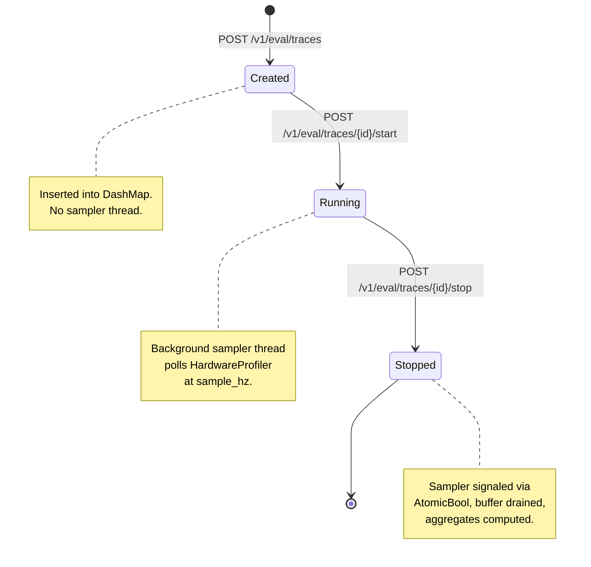

# Internals

## Crate layout

```
target/
├── Cargo.toml              workspace root
├── agent/                  HTTP server binary (edge-eval-agent)
│   └── src/
│       main.rs             CLI entry, argument parsing, router setup
│       routes.rs           Axum handlers for /v1/eval/*
├── monitor/                Trace state machine + sampling logic
│   └── src/
│       lib.rs              crate root
│       trace.rs            TraceStore state machine, sampler thread
│       aggregate.rs        Metric aggregation (mean, max, swap)
│       api_types.rs        Request/response types (CreateTraceRequest, TraceResponse, etc.)
│       error.rs            CoreError (NotFound, Conflict, BadRequest)
└── hal/                    HardwareProfiler trait + platform backends
    └── src/
        lib.rs              HardwareProfiler trait, HardwareSample, DeviceInfo, Capabilities
        os_linux/           Linux backend (built-in, always available)
        │   mod.rs          OsLinuxProfiler struct + trait impl
        │   memory.rs       /proc/meminfo system memory
        │   temp.rs         hwmon CPU temperature
        os_darwin/          macOS backend (built-in, cfg-gated)
        │   mod.rs          OsDarwinProfiler struct + trait impl
        │   memory.rs       Mach/BSD system memory
        │   gpu.rs          Global GPU utilisation (IOGPU)
        nvidia/             NVIDIA GPU backend (optional, feature=nvidia)
        │   mod.rs          NvidiaProfiler: probes NVML → Jetson sysfs → Unavailable
        │   nvml.rs         NVML library FFI via libloading (dlopen)
        │   jetson.rs       Jetson sysfs GPU load / temperature
        ├── cabi/           C ABI plugin interface (optional, feature=plugin)
        │   mod.rs          Rust FFI bindings for jishu_profiler.h
        │   jishu_profiler.h  C header for chip vendors
        ├── plugin/         Plugin loader (optional, feature=plugin)
        │   mod.rs          PluginProfiler (wraps .so via libloading)
        └── composite.rs    CompositeProfiler (builtin + gpu + plugin merge)
```

Key dependencies (`Cargo.toml` workspace):

| Dependency | Version | Purpose |
|------------|---------|---------|
| tokio | 1 (full) | Async runtime |
| axum | 0.7 | HTTP framework |
| serde / serde_json | 1 | JSON serialization |
| clap | 4 (derive + env) | CLI argument parsing |
| quanta | 0.12 | Monotonic clock (high-resolution) |
| dashmap | 5 | Concurrent trace store |
| parking_lot | 0.12 | Fast mutex for sample buffer |
| chrono | 0.4 | Wall-clock timestamps |
| tracing / tracing-subscriber | 0.1 / 0.3 | Structured logging |

## HAL: HardwareProfiler trait

The `HardwareProfiler` trait is the single interface that all profiler backends
implement:

```rust
pub trait HardwareProfiler: Send + Sync {
    fn name(&self) -> &'static str;
    fn capabilities(&self) -> Capabilities;
    fn device_info(&self) -> DeviceInfo { ... }   // <-- new: static device info
    fn sample(&self, clock: &quanta::Clock, epoch: Instant) -> HardwareSample;
    fn errors(&self) -> Vec<String>;
}
```

The `device_info()` method has a default implementation that returns all-`None`
fields. Backends override it to supply the information they can detect.

### HardwareSample fields (dynamic, per-sample)

| Field | Type | Description |
|-------|------|-------------|
| `t_mono_ns` | `u64` | Monotonic ns since epoch (from `quanta::Clock`) |
| `npu_util_pct` | `Option<f64>` | NPU utilisation 0–100% (always `None` in OS-level MVP) |
| `system_cpu_util_pct` | `Option<f64>` | System-wide CPU utilisation 0–100% |
| `mem_available_mb` | `Option<f64>` | Available memory (includes reclaimable cache) |
| `swap_used_mb` | `Option<f64>` | Used swap space |
| `gpu_util_pct` | `Option<f64>` | Global GPU utilisation on the supported macOS and NVIDIA backends |
| `gpu_mem_used_mb` | `Option<f64>` | Used GPU VRAM in MB |
| `temp_celsius` | `Option<f64>` | CPU / GPU temperature in Celsius |
| `load_avg_1m` / `5m` / `15m` | `Option<f64>` | System load average |

> Static fields `mem_total_mb` and `swap_total_mb` were moved from per-sample
> to [`DeviceInfo`](#deviceinfo) — they do not change during the agent's
> lifetime and should not be duplicated in every sample.

### DeviceInfo

Static device properties collected once at startup, reported via `/health` and
per-trace metadata:

| Field | Type | Source |
|-------|------|--------|
| `mem_total_mb` | `Option<f64>` | `/proc/meminfo` (Linux) / Mach VM stats (macOS) |
| `swap_total_mb` | `Option<f64>` | `/proc/meminfo` / sysctl `vm.swapusage` |
| `cpu_model_name` | `Option<String>` | `/proc/cpuinfo` `model name` / `sysctl hw.model` |
| `cpu_core_count` | `Option<u32>` | `available_parallelism()` |
| `cpu_max_freq_mhz` | `Option<f64>` | `/sys/devices/system/cpu/cpu0/cpufreq/cpuinfo_max_freq` / sysctl |
| `board_model` | `Option<String>` | Device-tree `/sys/firmware/devicetree/base/model` or DMI |
| `arch` | `Option<String>` | `uname -m`, fallback `std::env::consts::ARCH` |
| `gpu_mem_total_mb` | `Option<f64>` | NVIDIA NVML (aggregate across all GPUs) |
| `gpu_model` | `Option<String>` | NVIDIA driver string |
| `gpu_driver_version` | `Option<String>` | NVIDIA driver version |
| `cuda_version` | `Option<String>` | CUDA driver version |

### Capabilities

```rust
#[derive(Debug, Clone, Default, Serialize)]
pub struct Capabilities {
    pub npu_util: bool,
    pub system_cpu_util: bool,
    pub system_memory: bool,
    pub gpu_util: bool,
    pub gpu_memory: bool,       // <-- new: GPU VRAM tracking
    pub temp_celsius: bool,
    pub load_avg: bool,         // system load average
}
```

### Platform backends

| Backend | OS | Data sources | Feature |
|---------|----|--------------|---------|
| `OsLinuxProfiler` | Linux | `/proc/stat`, `/proc/loadavg`, `/proc/meminfo`, `/sys/class/hwmon` | built-in |
| `OsDarwinProfiler` | macOS | Mach CPU/VM stats, sysctl, IOGPU | built-in, `cfg(target_os = "macos")` |
| `NvidiaProfiler` | Linux | NVML `libnvidia-ml.so` via `dlopen`, Jetson sysfs | `feature = "nvidia"` |
| `PluginProfiler` | any | Dynamic `.so` via `libloading` | `feature = "plugin"` |

The type alias `PlatformProfiler` resolves to the appropriate OS backend at
compile time:

```rust
#[cfg(target_os = "linux")]
pub type PlatformProfiler = OsLinuxProfiler;

#[cfg(target_os = "macos")]
pub type PlatformProfiler = OsDarwinProfiler;
```

### CompositeProfiler (3-way merge)

When optional GPU and/or plugin profilers are available at build time, the agent
constructs a `CompositeProfiler` that merges results from up to **three**
sources, with this priority order:

1. **Plugin** (highest) — overrides everything
2. **GPU** (`NvidiaProfiler`) — overrides builtin
3. **Builtin** (OS backend) — default source

```rust
// In agent/src/main.rs (simplified):
let builtin = Arc::new(platform_profiler());

#[cfg(feature = "nvidia")]
let gpu = Some(Arc::new(hal::nvidia::NvidiaProfiler::new()));

#[cfg(feature = "plugin")]
let plugin = cli.profiler_plugin.as_ref()
    .and_then(|path| PluginProfiler::load(path).ok());

let profiler = CompositeProfiler::new(builtin, gpu, plugin);
```

The composite name reflects which backends are active, e.g.:
- `"os_linux"`
- `"os_linux+nvidia"`
- `"os_linux+my_plugin"`
- `"os_linux+nvidia+my_plugin"`

## NVIDIA backend (feature-gated)

The `nvidia` feature enables the `hal::nvidia` module, which implements GPU
monitoring through a **runtime probe** (not compile-time detection):

```
NvidiaProfiler::new()
  ├── NvmlSession::open()          → dlopen("libnvidia-ml.so")
  │   ├── success                  → NvidiaBackend::Nvml(session)
  │   └── fail                     → fall through to Jetson probe
  ├── jetson::detect_jetson()      → check sysfs GPU device nodes
  │   ├── true                     → NvidiaBackend::Jetson
  │   └── false                    → NvidiaBackend::Unavailable
  └── Unavailable                  → all GPU fields return None
```

This means `--features nvidia` can be safely enabled on any system — if no
NVIDIA GPU is present at runtime, the profiler degrades gracefully.

### Module structure

- **`nvidia/mod.rs`** — `NvidiaProfiler` enum with three variants (`Nvml`, `Jetson`, `Unavailable`), `HardwareProfiler` trait impl
- **`nvidia/nvml.rs`** — NVML FFI via `libloading`: `nvmlInit_v2`, `nvmlDeviceGetHandleByIndex`, `nvmlDeviceGetUtilizationRates`, `nvmlDeviceGetMemoryInfo`, `nvmlDeviceGetTemperature`, `nvmlDeviceGetName`, `nvmlDeviceGetBoardPartNumber`, `nvmlSystemGetDriverVersion`, `nvmlSystemGetCudaDriverVersion_v2`
- **`nvidia/jetson.rs`** — Jetson sysfs paths for GPU load and temperature, board model detection via `/sys/firmware/devicetree/base/model`

## Plugin system (C ABI)

The plugin system uses a C header (`jishu_profiler.h`) to define the vtable
contract between jishubench and chip-vendor profiler plugins.

### Header summary

```c
// Per-sample snapshot (dynamic fields only)
typedef struct {
    uint64_t t_mono_ns;        // filled by framework
    double   npu_util_pct;      // NaN = unavailable
    double   system_cpu_util_pct;
    double   mem_available_mb;
    double   swap_used_mb;
    double   gpu_util_pct;
    double   gpu_mem_used_mb;   // <-- new
    double   temp_celsius;
} jishu_hw_sample_t;

// Capability flags
typedef struct {
    bool npu_util, system_cpu_util, system_memory;
    bool gpu_util, gpu_memory;  // <-- new: gpu_memory
    bool temp_celsius;
} jishu_capabilities_t;

// Static device info (new)
typedef struct {
    double mem_total_mb;            // NaN = unavailable
    double swap_total_mb;           // NaN = unavailable
    double gpu_mem_total_mb;        // NaN = unavailable
    const char* gpu_model;          // NULL = unavailable
    const char* gpu_driver_version; // NULL = unavailable
    const char* cuda_version;       // NULL = unavailable
} jishu_device_info_t;

// Profiler vtable
typedef struct jishu_profiler {
    const char* (*name)(void* ctx);
    jishu_capabilities_t (*capabilities)(void* ctx);
    jishu_hw_sample_t (*sample)(void* ctx, uint64_t epoch_ns);
    void (*destroy)(void* ctx);
    void* ctx;
} jishu_profiler_t;

// Entry points exported by plugin .so
jishu_profiler_t* jishu_profiler_create(void);
jishu_device_info_t* jishu_profiler_device_info(void* ctx);  // <-- new
```

### Static info split

`mem_total_mb` and `swap_total_mb` were removed from the per-sample struct and
moved to `jishu_device_info_t`. The framework calls
`jishu_profiler_device_info()` once at startup rather than reading these
unchanging values on every sample loop iteration. The plugin may return NULL if
it has no device info to report.

## TraceStore state machine

TraceStore is the in-memory trace state machine backed by
`DashMap<String, Mutex<TraceData>>`.



### Sampler lifecycle

- **Start**: A dedicated OS thread named `sampler-{trace_id}` is spawned.
  It loops at `sample_interval` duration, calling
  `HardwareProfiler::sample()` and pushing results into a shared
  `Arc<Mutex<Vec<SampleRecord>>>`.
- **Stop** (three-phase design):
  1. Validate state and take the `SamplerHandle` (drops DashMap shard lock)
  2. Signal `AtomicBool::store(true)`, sleep one interval + 10ms margin,
     drain the shared buffer
  3. Re-acquire shard lock, set status to `Stopped`, compute aggregates

### Guard rails

- **max_samples**: Sampling stops automatically when this limit is reached
  (OOM guard, default 1200 samples)
- **Duplicate create**: Returns `409 Conflict`
- **Stop without start**: Returns `400 Bad Request`
- **Mark after stop**: Returns `400 Bad Request`

## Development commands

```bash
# Tests (Rust unit + integration)
cargo test

# Lint
cargo clippy -- -D warnings

# Format check
cargo fmt --check

# Format (apply)
cargo fmt

# Build with plugin support
cargo build --features plugin

# Build with NVIDIA GPU monitoring
cargo build --features nvidia

# Build with both plugin + NVIDIA
cargo build --features nvidia,plugin
```
